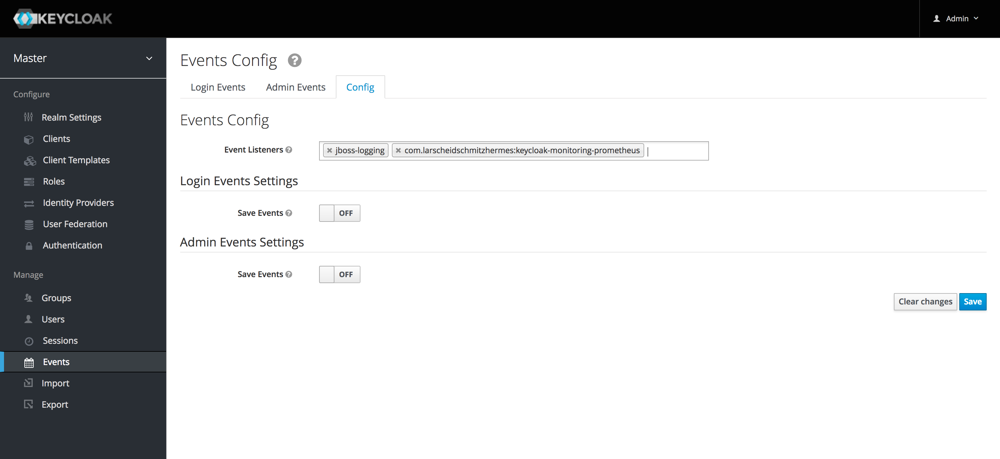

[](https://jitpack.io/#larscheid-schmitzhermes/keycloak-monitoring-prometheus)
[](https://jitpack.io/#larscheid-schmitzhermes/keycloak-monitoring-prometheus)

# keycloak-monitoring-prometheus
Out of the box, `keycloak` does not expose any metrics about what it is doing.
It does however allow you to write code that is listening to all kinds of keycloak-internal events.
This project counts those events and allows you to expose them to `prometheus` with the [`prometheus-filesystem-exporter`](https://github.com/larscheid-schmitzhermes/prometheus-filesystem-exporter).
## What metrics do you get?
This project will help you expose two metrics:

- `keycloak_events_total` with labels
    - realm="String",
    - type="[`org.keycloak.events.EventType`](https://github.com/keycloak/keycloak/blob/master/server-spi-private/src/main/java/org/keycloak/events/EventType.java)",
    - client_id="String",
    - ip_address="String"
- `keycloak_admin_events_total` with labels
    - realm="String"
    - operation="[`org.keycloak.events.admin.OperationType`](https://github.com/keycloak/keycloak/blob/master/server-spi-private/src/main/java/org/keycloak/events/admin/OperationType.java)"
    - resource="[`org.keycloak.events.admin.ResourceType`](https://github.com/keycloak/keycloak/blob/master/server-spi-private/src/main/java/org/keycloak/events/admin/ResourceType.java)",
    - client_id="String",
    - ip_address="String"

The magic lies in the labels. The labels basically expose the underlying keycloak event details and allow for detailed filtering. The unique metric + label combination's value will be increased by one whenever an event of this type is emmited in keycloak.
## Setup
### Install SPI
The code in this project compiles into an SPI that needs to be installed to your keycloak instance.
The simplest way is to download the latest JAR [from jitpack.io](http://jitpack.io/com/github/larscheid-schmitzhermes/keycloak-monitoring-prometheus/master/keycloak-monitoring-prometheus-master-SNAPSHOT.jar) and put it into your keycloak installation directory/providers.
Detailled instructions on SPI installation can be found in the [keycloak docs](http://www.keycloak.org/docs/3.3/server_development/topics/providers.html).
Also make sure to check out the [`Dockerfile`](Dockerfile).
### Configure SPI
The SPI requires you to provide a configuration option describing where to write the event counter files.
#### Configuring in standalone.xml
SPI configuration happens in keycloaks `standalone.xml`.
Within `<subsystem xmlns="urn:jboss:domain:keycloak-server:1.1"></subsystem>` you need to add the following lines:
```xml
<spi name="eventsListener">
    <provider name="com.larscheidschmitzhermes:keycloak-monitoring-prometheus" enabled="true">
        <properties>
            <property name="eventsDirectory" value="/metrics"/>
         </properties>
    </provider>
</spi>
```
For a more advanced example (directory name read from env variable) see the [`Dockerfile`](Dockerfile) again.
#### Configuring using an environment variable
The metrics directory can be specified by setting the `KEYCLOAK_PROMETHEUS_EVENTS_DIR` environment variable.
This value will only be used if the `eventsDirectory` configuration value is not set or if it is an empty string.
### Configuration in keycloak

In keycloak's admin console under `Events > Config` you need to add `com.larscheidschmitzhermes:keycloak-monitoring-prometheus` as an Event Listener.
Make sure you do this for every realm you want to monitor!
### Getting your metrics into prometheus
Once everything is setup in keycloak, you will start seeing files like `keycloak_admin_events_total;realm=master;operation=CREATE;resource=USER` in your configured events directory.
These files contain a number stating how often an event with the given parameters was emitted.
The naming scheme is compatible with [`prometheus-filesystem-exporter`](https://github.com/larscheid-schmitzhermes/prometheus-filesystem-exporter),
which you should run next to keycloak to get your events exposed in a prometheus compatible format.
